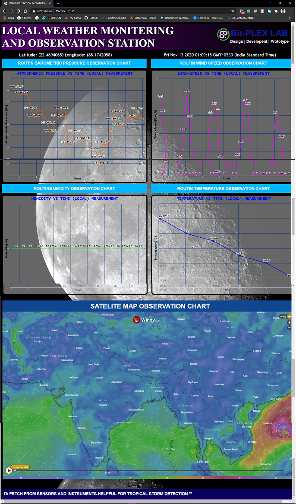

# esp32-based-weather-mointoring-station (** the project is undergoing and not complete yet**)
This is  a esp32wroom32d based weather monitoring system. The project consist with severel sensors to measure the wind speed, humidity, atmospheric pressure, temperature and a  useful weather forecasting satellite map. The UI design is WRITTEN IN HTML ,JAVASCRIPT ,CSS languages.

